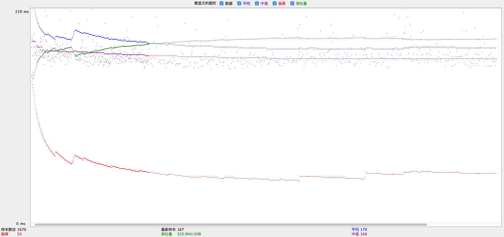
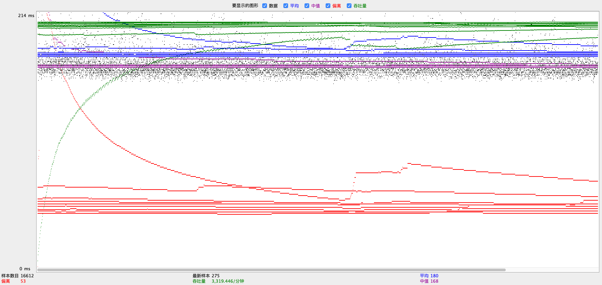
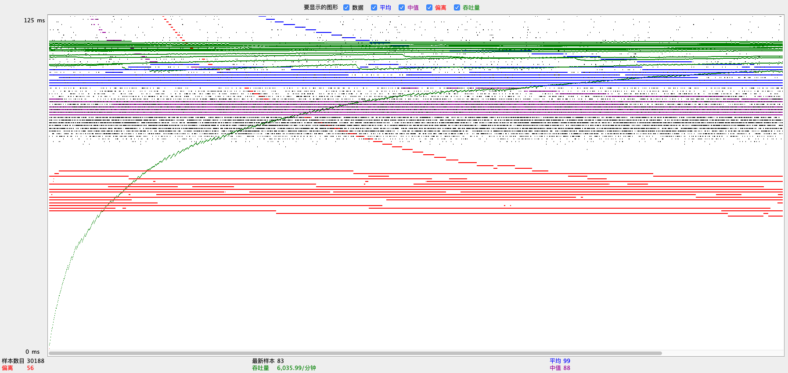
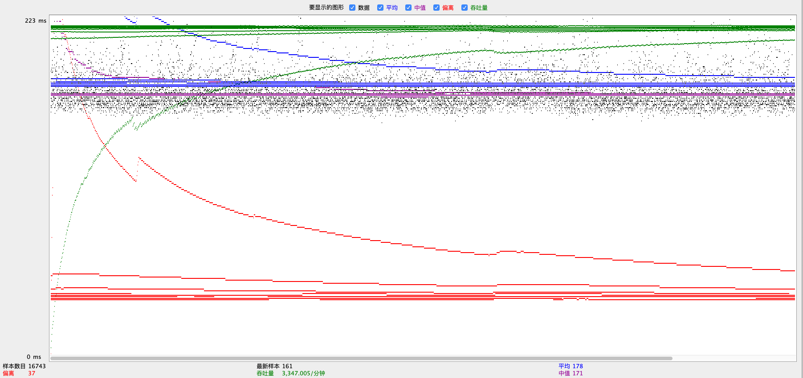
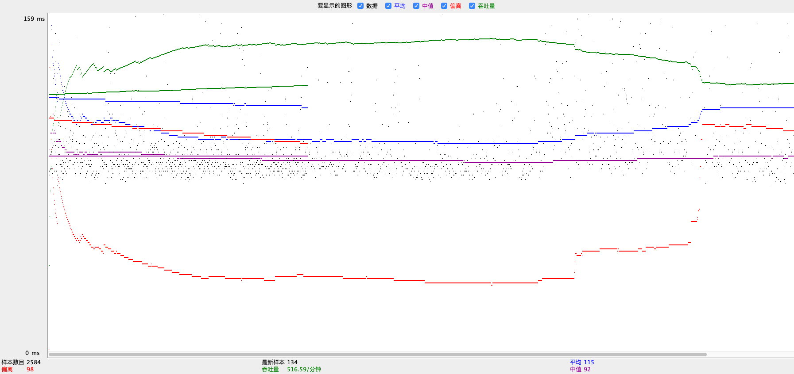
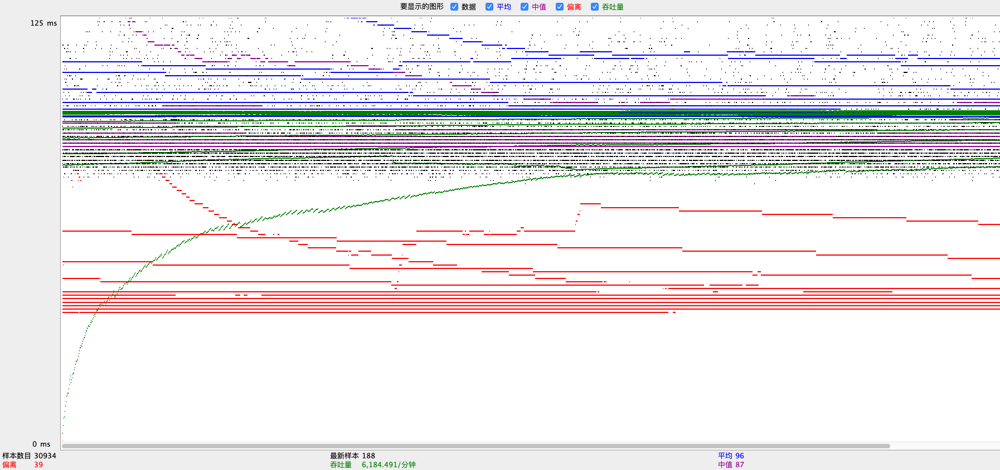

# Online Movie Mall
- [Online Movie Mall](#online-movie-mall)
	- [Contributors](#contributors)
	- [Frameworks](#frameworks)
	- [Deployment](#deployment)
	    - [Scaled-instance version](#scaled-instance-version)
        - [Single-instance version](#single-instance-version)
	- [Design Details](#design-details)
		- [Substring matching design](#substring-matching-design)
		- [Prepare Statement](#prepare-statement)
		- [XML Parser](#xml-parser)
			- [Error report](#error-report)
		- [Connection Pooling](#connection-pooling)
		- [Master/Slave](#masterslave)
		- [JMeter TS/TJ Time Logs](#jmeter-tstj-time-logs)
		- [JMeter TS/TJ Time Measurement Report](#jmeter-tstj-time-measurement-report)

## Contributors
* [Zhiyu Tao](https://github.com/zhiyutao)
* [Xiaoxi Wang](https://github.com/MintYiqingchen)

## Frameworks
* [Spring Boot](https://spring.io)
* [Bootstrap](https://getbootstrap.com)

## Deployment
### Scaled-instance version
1. Set both **Master** and **Slave**
    For both **Master** and **Slave** instance:
    
    ```shell script
   local> sudo apt-get update
   local> sudo apt-get install mysql-server
    ```

    Edit the `/etc/mysql/mysql.conf.d/mysqld.cnf` file and set the `bind-address` to `0.0.0.0`. Also, uncomment the lines of server-id and log_bin properties, set distinct server-id.
    
    Installing `MySQL Router` on both instances.
    
    ```shell
   local> git clone https://github.com/UCI-Chenli-teaching/cs122b-spring20-team-28.git
   local> sudo \rm -rf /var/lib/mysql/auto.cnf
   local> sudo mv cs122b-spring20-team-28/mysqlrouter.conf /etc/mysqlrouter/
   local> sudo service mysql restart
    ```
2. Set **Master**
    ```shell
   master-shell> mysql -u root -p 
    ```
    ```mysql
   mysql> CREATE USER 'mytestuser'@'%' IDENTIFIED BY 'mypassword';
   mysql> GRANT ALL PRIVILEGES ON *.* TO 'mytestuser'@'%';
   mysql> show master status;
    ```

3. Set **Slave**
    ```shell
   slave-shell> mysql -u root -p 
    ```
   ```mysql
   mysql> CHANGE MASTER TO MASTER_HOST='172.2.2.2', MASTER_USER='repl', MASTER_PASSWORD='slavepassword', MASTER_LOG_FILE='mysql-bin.000001', MASTER_LOG_POS=337;
   # change these parameters to corresponding values.
   mysql> start slave;
   mysql> show slave status;
   ```

4. Set database on **Master**
    
    Populate data
	```shell
	local> wget https://grape.ics.uci.edu/wiki/public/raw-attachment/wiki/cs122b-2019-winter-project1/movie-data.sql
	local> mysql -u mytestuser  -p < cs122b-spring20-team-28/create_table.sql
	local> mysql -u mytestuser -Dmoviedb -p < /home/ubuntu/movie-data.sql
	local> mysql -u mytestuser -Dmoviedb -p < cs122b-spring20-team-28/stored-procedure.sql
	local> mysql -u mytestuser -Dmoviedb -p -e "alter table sales add column count int not null default 1;"
    ```
    
    Encrypt password
	```shell
	# ! IMPORTANT EXECUTE this only once !
	local > cd cs122b-spring20-team-28/encrypt-tool
    local > mvn compile
	local > mvn exec:java -Dexec.mainClass="UpdateSecurePassword"
	```
 
    Parse XML
 	Put `stanford-movies\` in `cs122b-spring20-team-28/`
 	```shell
 	local> cd cs122b-spring20-team-28/
 	local> mvn package
 	local> mkdir log
 	local> java -jar parser-tool/target/cs122b.jar
 	```
  
5. Execute project on both **Master** and **Slave**
    ```shell script
    local> java -jar -Dserver.tomcat.basedir=tomcat -Dserver.tomcat.accesslog.enabled=true ./fablix-web/target/cs122b.jar --useSSL=false --write.port=7002 --read.port 7001
    local> tail -f tomcat/logs/ # show access logs
    ```

6. Set balancer
    ```shell script
    local> sudo apt-get install apache2
    local> sudo a2enmod proxy proxy_balancer proxy_http rewrite headers lbmethod_byrequests
    local> sudo mv cs122b-spring20-team-28/000-default.conf /etc/apache2/sites-enabled/000-default.conf
    local> sudo service apache2 restart
    ```

7. Open th URL *http://BALANCER_PUBLIC_IP:80*


### Single-instance version
1. Clone the repo from github.

	```shell
	local> git clone https://github.com/UCI-Chenli-teaching/cs122b-spring20-team-28.git
	```

2. Create a MySQL user and grant 
    ```Bash
   local> mysql -u root -p 
   ```
	```mysql
	mysql> CREATE USER 'mytestuser'@'localhost' IDENTIFIED BY 'mypassword';
	mysql> GRANT ALL PRIVILEGES ON *.* TO 'mytestuser'@'localhost';
	mysql> quit;
	```

3. Build Database

	```shell
	local> wget https://grape.ics.uci.edu/wiki/public/raw-attachment/wiki/cs122b-2019-winter-project1/movie-data.sql
	local> mysql -u mytestuser  -p < cs122b-spring20-team-28/create_table.sql
    local> mysql -u mytestuser -Dmoviedb -p < /home/ubuntu/movie-data.sql
    local> mysql -u mytestuser -Dmoviedb -p < cs122b-spring20-team-28/stored-procedure.sql
    local> mysql -u mytestuser -Dmoviedb -p -e "alter table sales add column count int not null default 1;"
	```
  
4. Encrypt password
	```shell
	# ! IMPORTANT EXECUTE this only once !
	local > cd encrypt-tool
    local > mvn compile
	local > mvn exec:java -Dexec.mainClass="UpdateSecurePassword"
	```
5. generate Certificate
    ```shell
    local> cd cs122b-spring20-team-28
    local> cd fablix-web/src/main/resources
    local> keytool -genkey -alias fabflix -keyalg RSA -keystore keystore
    // you'd better set the password as "mypassword"
    ```
   change the file application.properties, set `server.ssl.key-store-password=mypassword`.
5. Parse XML
	Put `stanford-movies\` in `cs122b-spring20-team-28/`
	```shell
	local> cd cs122b-spring20-team-28/
	local> mvn package
	local> mkdir log
	local> java -jar parser-tool/target/cs122b.jar

	```
6. Build the `jar` file and execute
	```shell
	local> cd fablix-web/
    local> mvn package
    local> cd .. # cs122b-spring20-team-28/
    local> java -jar ./fablix-web/target/cs122b.jar
	```
	
7. Open the URL [http://localhost:8443](http://localhost:8443)


## Design Details
### Substring matching design

1. Use `LIKE %KEYWORD%` pattern in searching title, director and star's name.

2. Use `LIKE INITIAL%` when browsing by movie title starts with alphanumerical characters.

3. Use `not regexp '^[a-zA-Z0-9]'` when browsing by movie title starts with non-alphanumerical characters. 

### Prepare Statement
1. For template with argument, see `queryTemplate.sql`
2. For template with placeholder `?`, see all files in `fablix-web/src/main/java/com/mintyi/fablix/dao/Impl`

### XML Parser
1. optimization 1: Batch insert sql. Using `insert ... values (?, ?), (?, ?) ...` instead of `insert ... value (?, ?)`
2. optimization 2: Temporary memory table. Create temporary memory table using `create temporary table tmp_stars engine memory as select * from stars where 1=2;`. After inserting all data, copy data into original table using sql like `insert into stars select * from tmp_stars`.

Performance:
|   | star  | movie + genre + genre in movie |  star in movie + addtional star |
|---|---|---|---|
| naive  | 23831 ms  | 34042 ms  | 452600 ms  |
| optim1 | 552ms  | 1422 ms  | 360343 ms  |
| optim2 | 570ms  | 1316 ms  |  312259 ms |

#### Error report
After run , see `log/**` and stdout.
* badActor.txt: generated by parsing actors63.xml (no bad record there)
* badMain.txt: generated by parsing mains243.xml (26 bad records). Each bad record contains invalid tuple (id, title, year, director). If one of the title, year and director is null, we consider it's a bad record.
* badCast.txt: generated by parsing casts124.xml (2019 bad records). Each bad record contains invalid tuple (star name, movie id). If one of the star name and movie id is null, or star name is "s a", we consider it's a bad record.


### Connection Pooling
- #### Include the filename/path of all code/configuration files in GitHub of using JDBC Connection Pooling.
    fablix-web/src/main/resources/application.properties
	Default setting of Spring boot 5.x.x  is to use HikariCP Connection Pool, so we don't need to change this file. 
	When want to use other connection pool or disable connection pool in Spring boot, change the value of `spring.datasource.type` to change datasource.
- #### Explain how Connection Pooling is utilized in the Fabflix code.
    Default setting of Spring boot 5.x.x  is to use HikariCP Connection Pool, so we don't need to change current code.
- #### Explain how Connection Pooling works with two backend SQL.
    * When the application start, the connection pool create several connections in advance.
	* Thread requires an idle connection from the connection pool by calling `pool.getConnection()`, then doing database operations
	* Thread return the connection to the pool by calling `conn.close()`

### Master/Slave
- #### Include the filename/path of all code/configuration files in GitHub of routing queries to Master/Slave SQL.
	In `fablix-web/src/main/resources/application.properties`, setting value `write.port` and `read.port`. Or using command line argument like:
	```bash
	$> java -jar -Dserver.tomcat.basedir=tomcat -Dserver.tomcat.accesslog.enabled=true ./fablix-web/target/cs122b.jar --useSSL=false --write.port=7002 --read.port 7001
	```
	mysqlrouter.conf
	```bash
	mysqlrouter --config=mysqlrouter.conf
	```
- #### How read/write requests were routed to Master/Slave SQL?
    We use mysqlrouter to choose Mysql instance when doing write or read operation.
	In our code `fablix-web/src/main/java/com/mintyi/fablix/FablixApplication.java`, we've configured two datasource (port:7001 for read-only, port:7002 for read_write).
	When doing read-only task, we direct the query to port 7001. Otherwise, we direct the sql to 7002.

### JMeter TS/TJ Time Logs
- #### Instructions of how to use the `log_processing.*` script to process the JMeter logs.
	```bash
	python log_processing.py log/performance.txt
	```

### JMeter TS/TJ Time Measurement Report

| **Single-instance Version Test Plan**          | **Graph Results Screenshot** | **Average Query Time(ms)** | **Average Search Servlet Time(ms)** | **Average JDBC Time(ms)** | **Analysis** |
|------------------------------------------------|------------------------------|----------------------------|-------------------------------------|---------------------------|--------------|
| Case 1: HTTP/1 thread                          | | 179             | 3.0018                              | 2.8802                    | Reasonable: avg(TS)>avg(TJ)           |
| Case 2: HTTP/10 threads                        | | 180             | 2.9667                              | 2.9049                    | Roughly same result as Case 1. Our server works well.           |
| Case 3: HTTPS/10 threads                       | | 99              | 3.7673                              | 3.7098                    | HTTPS need decryption and encryption. This make heavier CPU load, which may slow down the servlet and mysql working. The query time decrease because the query isn't redirected. This reduce the time by ~1 RRT.           |
| Case 4: HTTP/10 threads/No connection pooling  | | 178             | 3.3013                              | 3.2375                    | Connection pool can somehow reduce the query time (compare with case2)           |

| **Scaled Version Test Plan**                   | **Graph Results Screenshot** | **Average Query Time(ms)** | **Average Search Servlet Time(ms)** | **Average JDBC Time(ms)** | **Analysis** |
|------------------------------------------------|------------------------------|----------------------------|-------------------------------------|---------------------------|--------------|
| Case 1: HTTP/1 thread                          | | 115             | 2.4926                              | 2.3901                    | Comparing with case 1 of the single version, Query time reduce by ~1 RRT, because in scaled version, HTTP request won't be redirected. And it seems scaled version has both less TS and TJ.          |
| Case 2: HTTP/10 threads                        | | 96              | 3.4146                              | 3.3713                    | Comparing with case 2 of the single version, TS and TJ increase. This is caused by mysql route requests to other machine that takes more network time.           |
| Case 3: HTTP/10 threads/No connection pooling  | | 117             | 4.6779                              | 4.6245                    | The slow-down phenomenon is expected. Same reason as case 4 of single version and case 2 of scaled version           |
